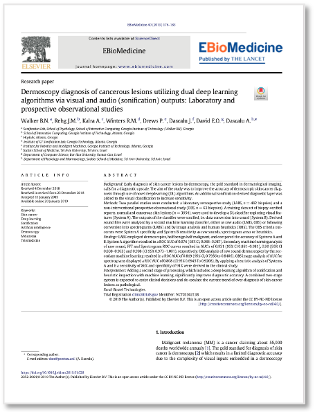
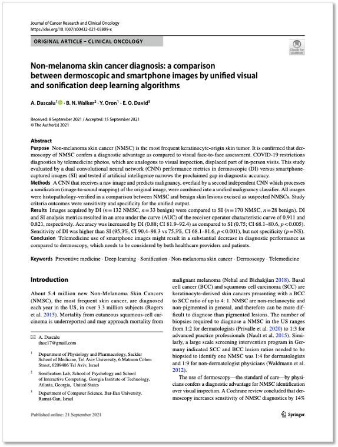
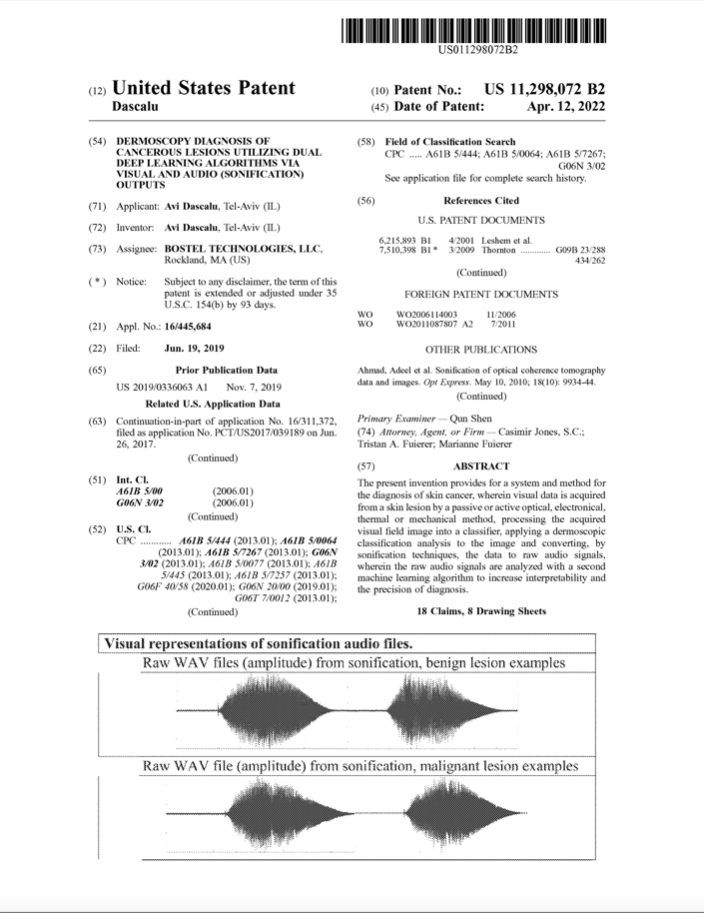
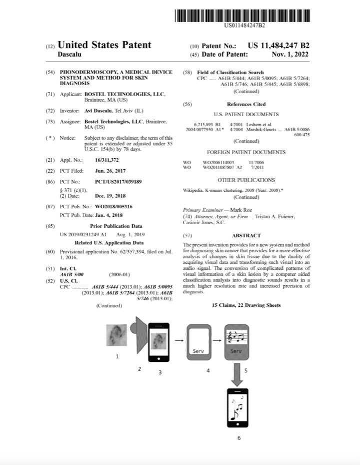

---
# Feel free to add content and custom Front Matter to this file.
# To modify the layout, see https://jekyllrb.com/docs/themes/#overriding-theme-defaults

id: publications
layout: default
title: Publications
description: 
slug: publications
---
<!-- 

 -->

    

        <h1 class="h5 page-label">{{ site.t.publications }}</h1>
        <h2 class="h1 page-title">{{ site.t.prevention_over_treatment }}</h2>
    

<article class="page-content">  
    

        <section class="page-section">
            

                

                    
                    

                        
                        <h4 class="h4">Dermoscopy diagnosis of cancerous lesions utilizing dual deep learning algorithms via visual and audio (sonification) outputs: Laboratory and prospective observational studies</h4>
                        
EBioMEdicine; February 2019, Volume 40, Pages 176–183  https://doi.org/10.1016/j.ebiom.2019.01.028
 

                        

                            <a href="/dermoscopy-diagnosis-cancerous-lesions">Read More</a>
                            <a class="btn btn--icon btn--icon-light pdf-btn" href="/assets/PIIS2352396419300337.PDF" target="_blank"><svg class="icon" aria-title="download PDF"><use xlink:href="/assets/site.svg#pdf-download" /></svg></a>
                        

                         
                    

                    
                    

                        
                        <h2 class="h4">Skin cancer detection by deep learning and sound analysis algorithms: A prospective clinical study of an elementary dermoscope</h2>
                        
EBioMEdicine; May 2019, Volume 43, Pages 107–113  https://doi.org/10.1016/j.ebiom.2019.04.055
 

                        

                            <a href="/skin-cancer-detection-deep-learning-sound-analysis-algorithms">Read More</a>
                            <a class="btn btn--icon btn--icon-light pdf-btn" href="/assets/PIIS2352396419302944.pdf" target="_blank"><svg class="icon" aria-title="download PDF"><use xlink:href="/assets/site.svg#pdf-download" /></svg></a>
                        

                         
                    

 
                
    
                    
                

                    
 
                    

                        
                        <h4 class="h4">Hearing artificial intelligence: Sonification guidelines & results from a case-study in melanoma diagnosis</h4>
                        
International Conference on Auditory Displays (ICAD); June 2019  http://hdl.handle.net/1853/61501
 

                        

                            <a href="/sonification-for-melanoma-diagnosis">Read More</a>
                            <a class="btn btn--icon btn--icon-light pdf-btn" href="/assets/icad2019_021.pdf" target="_blank"><svg class="icon" aria-title="download PDF"><use xlink:href="/assets/site.svg#pdf-download" /></svg></a>
                        

                    

                                        
                    

                        
                        <h4 class="h4">Non-melanoma skin cancer diagnosis: a comparison between dermoscopic and smartphone images by unified visual and sonification deep learning algorithms</h4>
                        
Journal of Cancer Research and Clinical Oncology, 2021 (accepted Sept 15) https://doi.org/10.1007/s00432-021-03809-x
 

                        

                            <a href="/non-melanamoma-skin-cancer-diagnosis">Read More</a>
                            <a class="btn btn--icon btn--icon-light pdf-btn" href="/assets/JCRCO-2021-DascaluWalkerOronDavid.pdf" target="_blank"><svg class="icon" aria-title="download PDF"><use xlink:href="/assets/site.svg#pdf-download" /></svg></a>
                        

                    

 

                

                
            
 
                    

                        
                        <h4 class="h4">US Patent 11,298,072 B2: Dermoscopy diagnosis of cancerous lesions utilizing dual deep learning algorithms via visual and audio (sonification) outputs</h4>
                        
US Patent issued April 12, 2022 https://image-ppubs.uspto.gov/dirsearch-public/print/downloadPdf/11298072
 

                        

                            <a href="/patent-us11298072B2">Read More</a>
                            <a class="btn btn--icon btn--icon-light pdf-btn" href="/assets/Patent-US11298072B2.pdf" target="_blank"><svg class="icon" aria-title="download PDF"><use xlink:href="/assets/site.svg#pdf-download" /></svg></a>
                        

                    

                                        
                    

                        
                        <h4 class="h4">US Patent 11,484,247 B2: Phonodermoscopy, a medical device system and method for skin diagnosis</h4>
                        
US Patent issued November 1, 2022 https://image-ppubs.uspto.gov/dirsearch-public/print/downloadPdf/11484247
 

                        

                            <a href="/patent-us11484247B2">Read More</a>
                            <a class="btn btn--icon btn--icon-light pdf-btn" href="/assets/Patent-US11484247B2.pdf" target="_blank"><svg class="icon" aria-title="download PDF"><use xlink:href="/assets/site.svg#pdf-download" /></svg></a>
                        

                    

 

                
                
            

        </section>
    

    <!-- <section class="page-section">
        

            

                <h2>Care Campus Salutes the Release of the WHO iCOPE Tool</h2>
                <h4>7 October 2019 (Geneva)</h4>
                
Care Campus today salutes the World Health Organization on the release of its digital application to help health and social workers provide better care for older people.

                
Worldwide one billion people will be aged 60 or older by 2020.  By 2050 one in five people will be over 60, more than two billion people. The number of people aged over 80 is projected to triple from 143 million in 2019 to 426 million in 2050.

                
While every older person is different, both physical and mental capacity tend to decline with increasing age.  As intrinsic capacity diminishes, older adults need increasing levels of support and care to maintain their independence.  This latest resource, the WHO ICOPE Handbook App, is a welcome addition to the tools that can be used to help older adults age successfully and live their best life.

                
As described by the World Health Organization, the WHO ICOPE Handbook App is an interactive digital application that provides practical guidance to address priority conditions including mobility limitations, malnutrition, vision and hearing loss, cognitive decline, depressive symptoms and social care and support.  This App is the first integrated tool that caregivers can use to understand an older adult’s priorities and concerns with respect to their health and wellbeing and then develop integrated care plan to address them by leveraging local resources.

                
Care Campus interactive training and educational curriculum is well aligned with the iCOPE framework and is designed with a person-centric prospective to empower caregivers to help older adults to age with dignity.  According to the WHO, the 2030 Agenda and the Sustainable Development Goals will only be achievable if it is inclusive of people of all ages. Empowering older people by safeguarding their health and well-being enables their full participation and social inclusion are good ways to reduce inequalities.

                <h5>About Care Campus</h5>
                
Care Campus helps family members, paid care workers and others learn how to care with confidence.  Care Campus' certification program can help anyone seeking to become qualified as a paid care worker, one of the 21st century's fastest growing vocations.  Care Campus partners with care providers to help train and accredit their staff and then offers continuing education to help them remain current with the latest advancements in caregiving.  For more information please visit <a href="www.CareCampus.health">www.CareCampus.health</a>.

            

          
        

    </section>
     -->
</article>
